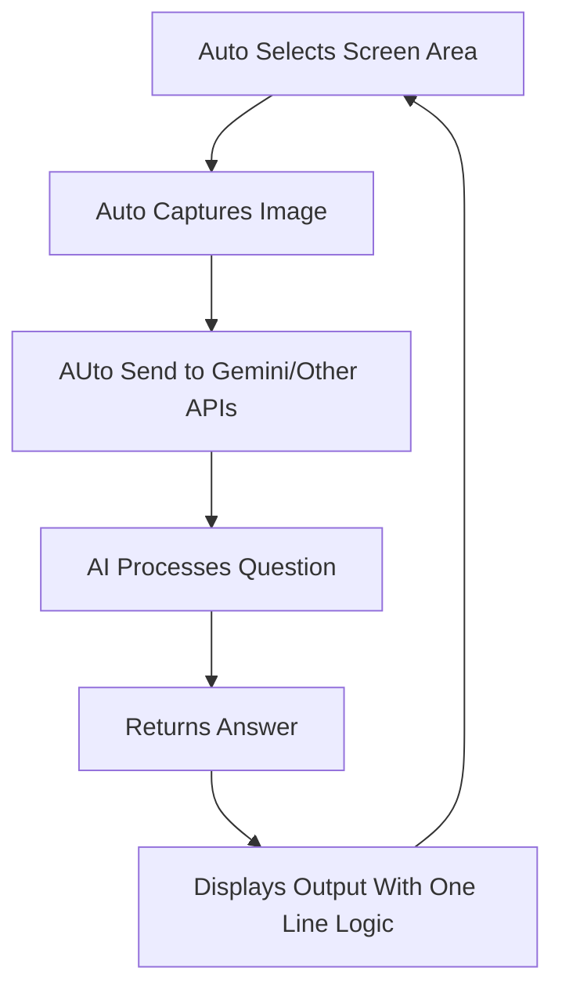

# 🚀 AutoScreenSolver

<p align="center">
  <b>Solve questions directly from your screen in seconds.</b><br>
  No typing. No tab switching. Just instant answers.
</p>

<p align="center">
  
  
  
  
</p>

---

## ✨ Overview

**AutoScreenSolver** is a minimal yet powerful Python tool that captures a selected region of your screen, sends it to Google Gemini, and returns answers automatically.

Built in ~20 lines of code, but does something genuinely useful.

---

## ⚡ Features

* 📸 Real-time screen capture
* 🤖 AI-powered solving using Gemini
* ⚡ Answers in ~ 5 (sometimes <10 seconds)
* 🔁 Auto-refresh every 30 seconds (customizable)
* 🧠 Uses latest Google Generative AI module
* 💸 Completely free with Gemini API

---

## 🧩 How It Works



---

## 🛠️ Tech Stack

* Python
* Google Gemini API
* Screen Capture Libraries (PIL / MSS etc.)

---

## 📦 Installation

```bash
git clone https://github.com/yourusername/AutoScreenSolver.git
cd AutoScreenSolver
pip install -r requirements.txt
```

---

## 🔑 Setup

Add your Gemini API key:

```python
API_KEY = "your_api_key_here"
```

---

## ▶️ Usage

```bash
python main.py
```

* Select the screen region
* Keep the question visible
* Let the script handle everything

---

## ⚙️ Configuration

You can tweak:

| Setting          | Description                   |
| ---------------- | ----------------------------- |
| Refresh Interval | Default 30 seconds            |
| Capture Area     | Custom screen region          |
| Prompt           | Modify how AI answers         |
| API              | Swap Gemini with other models |

---

## 📁 Project Structure

```bash
AutoScreenSolver/
│
├── main.py
├── requirements.txt
├── README.md
└── utils/ (optional)
```

---

## ⚠️ Limitations

* Depends on image clarity
* Complex diagrams may reduce accuracy

---

## 💡 Future Improvements

* GUI interface
* Faster refresh cycles
* Multi-question detection
* Clipboard integration
* Chrome extension version

---

## 🤝 Contributing

```bash
fork → clone → improve → pull request 🚀
```

Simple idea. Huge potential.

---

## ⭐ Support

```bash
⭐ Star this repo
🍴 Fork it
📢 Share it
```

---

## 📜 License

Free to use, modify, and distribute but don't charge for it.
Improving the community GPL.

---
